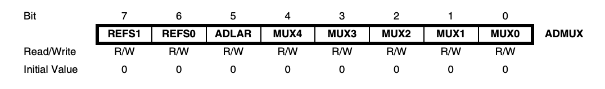
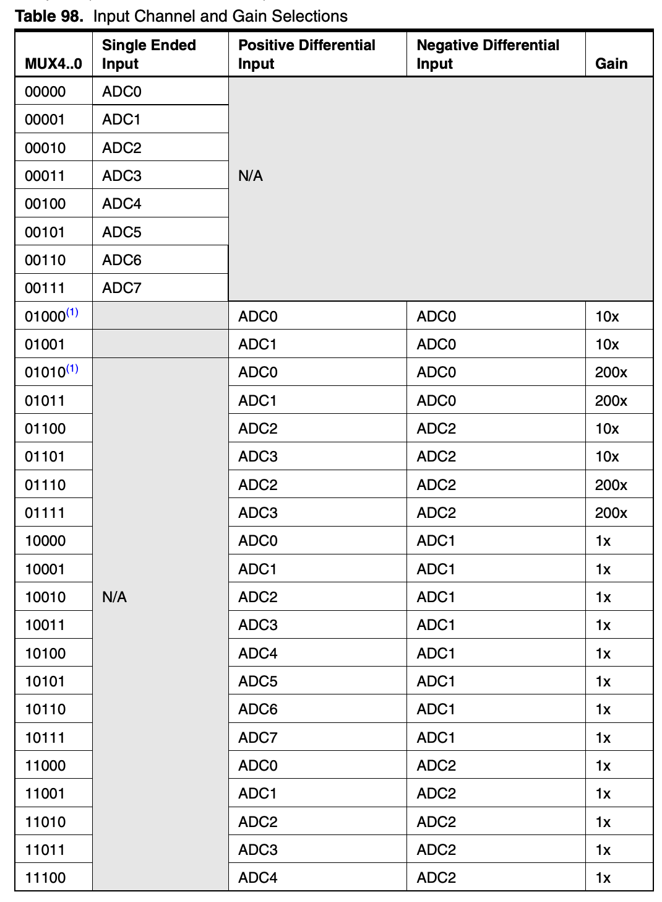
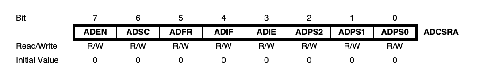

# 요약

ADC 멀티플렉서 선택 레지스터 ADMUX, ADC 제어 및 상태 레지스터 ADCSRA, ADC 데이터 저장을 위한 ADCH, ADCL로 총 4가지의 레지스터가 사용된다.

## ADMUX (ADC Multiplexer Selection Register)

### REFS1, REFS0 (Reference Selection) - 7, 6 Bit

ADC의 기준 전압을 정하는 비트이다.

|REFS1|REFS0|설명|
|---|---|---|
|0|0|AREF 단자에 공급되는 전압 이용|
|0|1|AVCC 단자의 전압 이용|
|1|0|(Reserved)|
|1|1|내부 2.56V 전압 이용|

### ADLAR (ADC Left Adjust Result) - 5 Bit

ADC 변환 완료된 데이터를 저장할 때 정렬할 방향을 정하기 위한 비트이다.

Set일때 왼쪽부터 정렬되어 저장되고, Clear일때 오른쪽부터 정렬되어 저장된다.

### MUX4, MUX3, MUX2, MUX1, MUX0 (Multiplexer Selection) - 4, 3, 2, 1, 0 Bit

ADC를 사용할 아날로그 입력 포트를 선택할 수 있다.

## ADCSRA (ADC Control and Status Register A)

### ADEN (ADC Enable) - 7 Bit

ADC를 허용하기 위한 비트이다. Set일 때 허용된다.

### ADSC (ADC Start Conversion) - 6 Bit

단일변환모드에서 변환을 시작하기 위해서 Set하고, 끝내기 위해서 Clear한다.

### ADFR (ADC Free Running Select) - 5 Bit

프리러닝모드 사용을 위한 비트로, Set일 때 사용되고, Clear일 때 단일변환모드가 사용된다.

### ADIF (ADC Interrupt Flag) - 4 Bit

변환이 완료되었을 때 Set되고, 만약 3번 비트인 ADIE가 Set이라면 ADC_vect 인터럽트가 발생한다.

### ADIE (ADC Interrupt Enable) - 3 Bit

변환이 완료되었을 때 인터럽트를 허용하는 비트이다.

### ADPS2, ADPS1, ADPS0 (ADC Prescaler Select) - 2, 1, 0 Bit

ADC의 분주를 설정하는 비트이다.

|ADPS2|ADPS1|ADPS0|설명|
|---|---|---|---|
|0|0|0|1|
|0|0|1|2|
|0|1|0|4|
|0|1|1|8|
|1|0|0|16|
|1|0|1|32|
|1|1|0|64|
|1|1|1|128|
