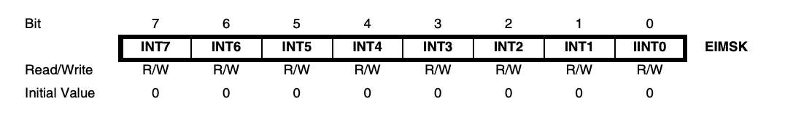
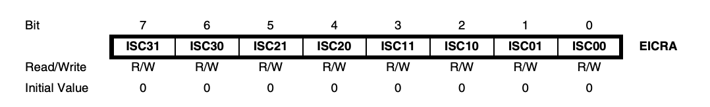
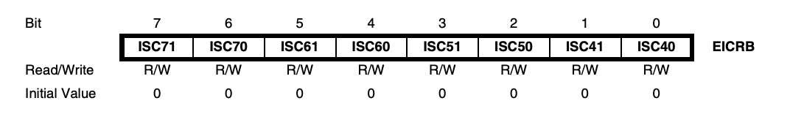

# 필요한 라이브러리

인터럽트를 사용하기 위해서는 avr/interrupt.h 라이브러리가 필요하다.

# 사용할 레지스터

인터럽트에서 주로 사용되는 레지스터는 EICRA, EICRB, EIMSK, SREG 4가지이다.

## SREG

모든 인터럽트를 활성화시키는 비트가 SREG의 맨 앞에 존재하기 때문에 0x80이라는 값을 기본적으로 사용한다.

```c
SREG = 0x80;
```

## EIMSK

특정 인터럽트를 활성화/비활성화 시키기 위해서 사용한다. 인터럽트 번호는 맨 앞에서 7부터 0까지이다.



## EICRn

인터럽트가 실행될 조건을 설정하기 위해서 사용한다. EICRA는 좌측부터 3부터 0까지, EICRB는 좌측부터 7부터 4까지이다.




|ISCn1|ISCn0|설명|
|---|---|---|
|0|0|누르고 있는 동안 인터럽트가 실행된다. (로우 레벨)|
|0|1|인터럽트를 사용하지 않는다.|
|1|0|눌렀을 때 인터럽트가 실행된다. (하강 에지)|
|1|1|떼었을 때 인터럽트가 실행된다. (상승 에지)|
