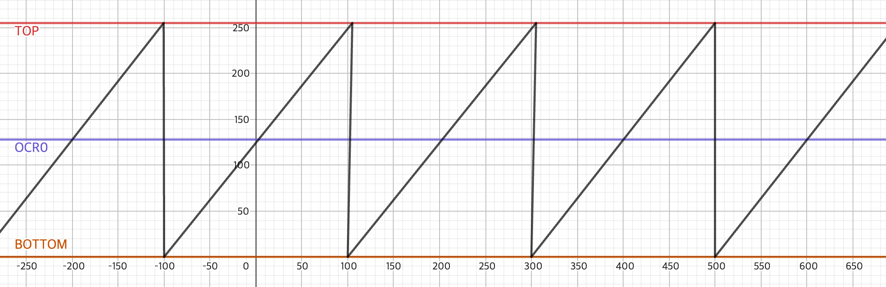
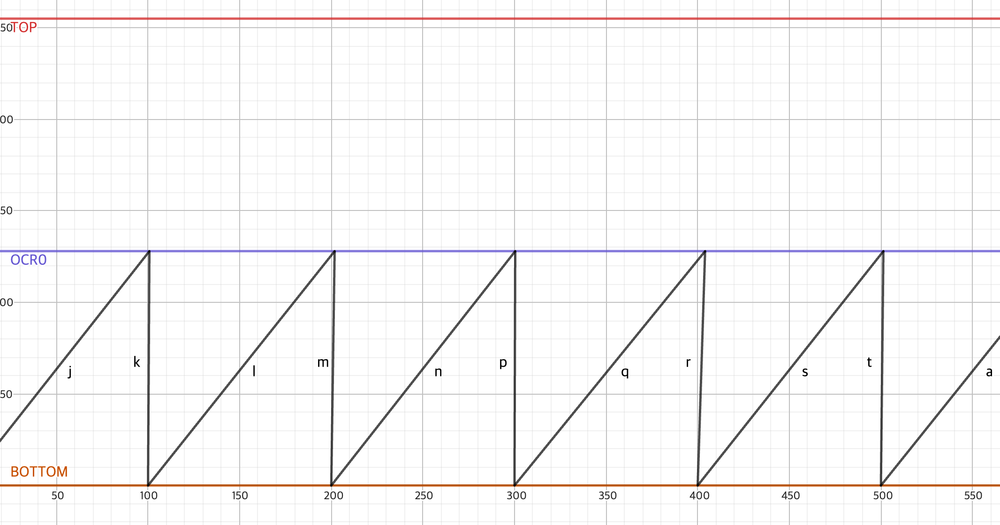
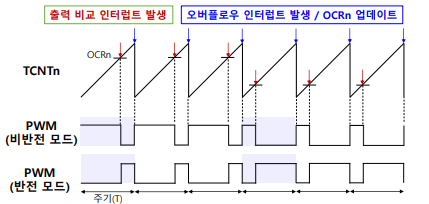

# T/C의 동작모드

이번 페이지에서는 T/C의 동작모드인 Normal, CTC, PWM, Fast PWM 모드에 대해서 정리해볼 것이다.

## Normal 모드

Normal 모드는 단순히 BOTTOM부터 TOP까지 순차적으로 상승하고, 오버플로우 되었을 때 0으로 돌아가는 과정을 반복한다.

## CTC 모드

CTC 모드는 Normal 모드와 비슷하게 BOTTOM부터 순차적으로 상승하지만, TOP 대신 OCR0의 값에 도달하면 0으로 돌아가는 과정을 반복한다.

## Fast PWM 모드

Fast PWM 모드는 간단하게 설명하면, OCR0에 도달했을 때 OC0이 Set되고, TOP에 도달했을 때 OC0이 Clear되는 과정이 반복된다. 직접 그래프로 확인해보면, OCR0과 BOTTOM의 차이가 클 수록 OC0이 Set되어 있는 시간이 더 커진다. (Inverting 모드)

Non-inverting 모드는 이와 반대이다.

[사진 출처](https://maloveforme.tistory.com/256)
