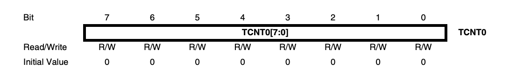
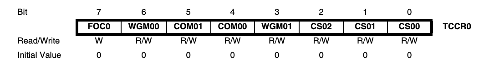
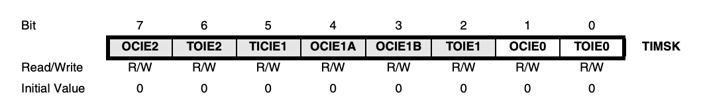

# 기본적인 레지스터

ATmega128에는 T/C (Timer/Counter), 즉 타이머가 4개가 존재하는데, 8Bit의 크기를 가진 T/C0, T/C2와 16Bit의 크기를 가진 T/C1, T/C3으로 나뉜다.

이러한 두 유형의 T/C는 사용되는 레지스터는 서로 비슷하지만 약간의 차이가 있다. 이번 페이지에서는 8bit T/C를 기준으로 설명할 것이다.

## 레지스터 요약

- **TCNTn** (T/C n)

    8Bit 0 ~ 255를 순차적으로 카운트하기 위한 레지스터이다.

- **TCCRn** (T/C Control Register n)

    T/C의 동작을 제어하는 레지스터이다. 타이머의 클럭 소스, 모드, 출력 등을 설정할 수 있다.

- **OCRn** (Output Compare Register n)

    TCNTn과 비교되어서 특정한 이벤트를 발생시키기 위해 사용되는 레지스터이다.

- **TIMSK** (T/C Interrupt Mask Register)

    사용할 T/C를 허용하기 위해 사용되는 레지스터이다.

- **TIFR** (T/C Interrupt Flag Register)

    T/C에서 인터럽트가 발생하는 등의 상태가 저장되는 레지스터이다.

## 레지스터 상세 설명

### TCNTn (T/C n)

8bit 0 ~ 255를 순차적으로 카운트하기 위한 레지스터이다.

### TCCRn (T/C Control Register n)

T/C의 동작을 제어하는 레지스터이다. 타이머의 클럭 소스, 모드, 출력 등을 설정할 수 있다.

#### FOCn (Force Output Compare) - 7 Bit

PWM 모드에서만 유효한 비트로, 해당 비트가 1이면 비교 출력 단자인 OC0으로 COM01과 COM00에 의해서 설정된 값이 즉시 출력이 된다.

일반적으로 사용되지 않으므로 기본값을 Clear로 설정하면 된다.

#### WGMn0, WGMn1 (Waveform Generation Mode) - 6, 3 Bit

T/C의 동작 모드를 결정하기 위한 두 비트이다.

|WGM00|WGM01|설명|
|---|---|---|
|0|0|Normal 모드|
|0|1|CTC(Clear Timer on Compare match) 모드|
|1|0|PWM(Pulse Width Modulation) 모드|
|1|1|Fast PWM 모드|

#### COMn1, COMn0 (Compare Match Output Mode) - 5, 4 Bit

T/C의 출력 모드를 결정하기 위한 두 비트이다. 다만 위의 동작 모드 (WGM00, WGM01)에 따라 출력 모드의 비트의 용도가 달라지기 때문에 알아둬야 한다.

##### PWM 모드가 아닐 때

|COM01|COM00|설명|
|---|---|---|
|0|0|일반 I/O 포트로 동작하며, OCn 포트를 사용하지 않는다.|
|0|1|OCn 포트에서 비교해서 일치하면 토글된다.|
|1|0|OCn Clear|
|1|1|OCn Set|

##### Fast PWM 모드일 때

|COM01|COM00|설명|
|---|---|---|
|0|0|일반 I/O 포트로 동작하며, OCn 포트를 사용하지 않는다.|
|0|1|사용되지 않음|
|1|0|비교 일치 시, OCn 포트을 Clear하고, OCn을 BOTTOM에서 Set한다.|
|1|1|비교 일치 시, OCn 포트를 Set하고, OCn을 BOTTOM에서 Clear한다.|

##### Phase Correct PWM 모드일 때

|COM01|COM00|설명|
|---|---|---|
|0|0|일반 I/O 포트로 동작하며, OCn 포트를 사용하지 않는다.|
|0|1|사용되지 않음|
|1|0|상향하고 있을 때 비교 일치 시, OCn 포트을 Clear하고, 하향하고 있을 때 비교 일치 시 OCn 포트를 Set한다.|
|1|1|상향하고 있을 때 비교 일치 시, OCn 포트를 Set하고, 하향하고 있을 때 비교 일치 시 OCn 포트를 Clear한다.|

#### CSn2, CSn1, CSn0 (Clock Select) - 4, 3, 2 Bit

T/C의 분주를 설정하기 위해서 사용되는 세가지의 비트이다.

|CSn2|CSn1|CSn0|설명|
|---|---|---|---|
|0|0|0|No Clock Source, 타이머가 중지된다.|
|0|0|1|클럭을 1로 나눈다.|
|0|1|0|클럭을 8로 나눈다.|
|0|1|1|클럭을 32로 나눈다.|
|1|0|0|클럭을 64로 나눈다.|
|1|0|1|클럭을 128로 나눈다.|
|1|1|0|클럭을 254로 나눈다.|
|1|1|1|클럭을 1024로 나눈다.|

### OCRn (Output Compare Register n)

TCNTn과 비교되어서 인터럽트와 같은 이벤트를 발생시키기 위해 사용되는 레지스터이다.

### TIMSK (T/C Interrupt Mask Register)

사용할 T/C를 허용하기 위해 사용되는 레지스터이다.

|비트|설명|
|---|---|
|OCIEn|출력 비교 일치 인터럽트를 허용하기 위해서 사용한다.|
|TOIEn|오버플로우 인터럽트를 허용하기 위해서 사용한다.|

